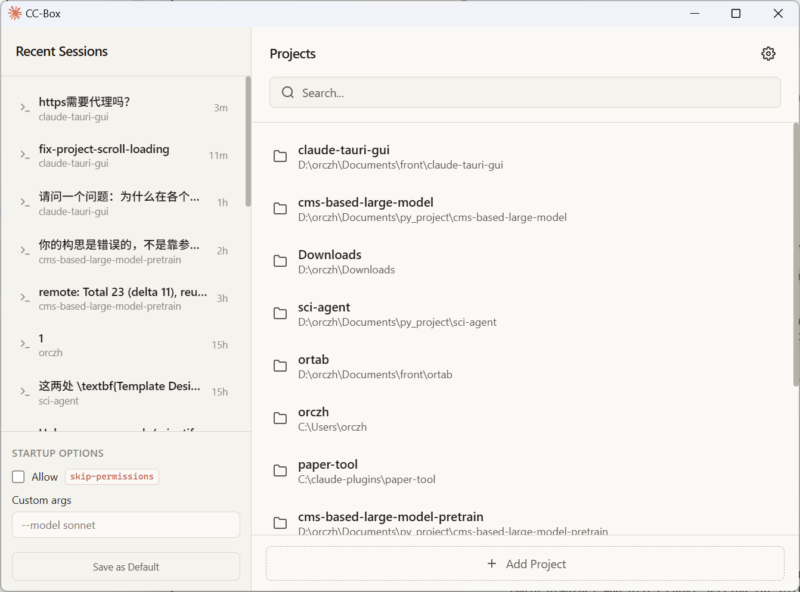
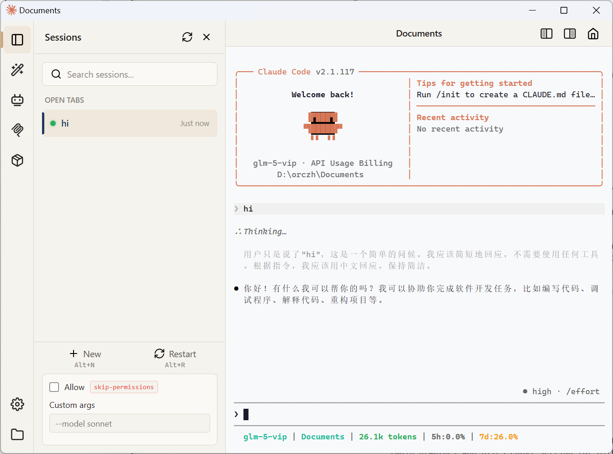

<p align="center">
  
</p>

<h1 align="center">CC-Box</h1>

<p align="center">
  <strong>Claude Code 桌面应用 — 多项目、多会话管理</strong><br>
  一个窗口。多个项目。快速切换会话。
</p>

<p align="center">
  
  
  
  
</p>

---

[English](README.md) | 简体中文

---

## 为什么选择 CC-Box？

Claude Code 的 CLI 在单会话工作中表现优秀。但当你需要管理**多个项目**，并希望**便捷地查看、进入、切换会话**时，纯终端就显得力不从心。

CC-Box 本质上是 **Claude Code 的桌面应用**。它保留了原生终端体验，并添加了 CLI 不擅长做的事：多项目管理、会话总览、快速切换。

**把它看作专为 Claude Code 重度用户打造的桌面应用。**

---

## 界面截图

<p align="center">
  
  
</p>

---

## 核心功能

### 多项目管理

在一个窗口中浏览所有项目。查看哪些项目有活跃会话，一键启动新会话，即时切换项目。不再需要频繁 `cd` 切换目录或管理多个终端窗口。

### 多会话并行

打开任意数量的 Claude Code 会话，每个会话在独立的终端标签页中运行。在侧边栏查看所有会话，快速切换，切换后输出内容保持不变。

### 快速启动与预设

为每个项目设置启动选项，如 `--resume`、`--model` 或自定义参数。无需每次输入相同参数，一键以预设配置启动会话。

### 侧边栏面板

非遮罩式侧边栏，不会抢占焦点：

- **会话** — 浏览、搜索、切换所有会话。状态指示灯显示运行/思考/等待状态。
- **MCP 服务器** — 查看已连接的 MCP 服务器、可用工具及其参数结构
- **Skills & Agents** — 快速访问 Claude Code skills 和 agent 配置
- **插件** — 查看已安装的插件及其组件

### 原生终端体验

通过伪终端直接运行 Claude CLI 二进制文件。所有功能与终端中完全一致 — slash 命令、快捷键、流式输出、颜色、交互式提示。

---

## 先决条件

- **[Claude Code CLI](https://docs.anthropic.com/en/docs/claude-code)** 已安装并完成认证
- **Windows 用户**: [Git for Windows](https://git-scm.com/download/win)（提供 Git Bash）

---

## 快速开始

### 1. 下载安装

前往 [**Releases**](https://github.com/orczh-hj/cc-box/releases) 页面下载对应平台的安装包：

| 平台 | 文件 |
|------|------|
| **Windows** | `.exe` (NSIS 安装包) 或 `.msi` |
| **macOS** | `.dmg` (通用二进制) |
| **Linux** | `.deb` 或 `.AppImage` |

国内用户可从 [Gitee Releases](https://gitee.com/orczh/cc-box/releases) 下载。

### 2. 启动使用

1. 打开应用
2. 选择或添加项目目录
3. Claude Code 会话启动 — 像在终端中一样输入
4. 从侧边栏打开更多会话，每个独立运行

---

## 从源码构建

<details>
<summary>点击展开</summary>

### 前置要求

- [Node.js](https://nodejs.org/) 18+
- [Rust](https://www.rust-lang.org/tools/install) stable 工具链
- [Claude Code CLI](https://docs.anthropic.com/en/docs/claude-code) 已安装并认证
- **Windows 用户**: [Git for Windows](https://git-scm.com/download/win)

### 安装

```bash
git clone https://github.com/orczh-hj/cc-box.git
cd cc-box
npm install
```

### 开发

```bash
npm run tauri:dev     # 启动开发模式（热重载）
```

### 构建

```bash
npm run tauri:build   # 构建当前平台

# 或指定平台：
npm run build:win     # Windows (x86_64-pc-windows-gnu)
npm run build:mac     # macOS (通用)
npm run build:linux   # Linux (x86_64)
```

构建产物在 `src-tauri/target/release/bundle/`。

</details>

---

## 常见问题

<details>
<summary><strong>会修改我的 Claude Code 配置吗？</strong></summary>

不会。应用只读取 Claude Code 原生文件。所有 GUI 设置独立保存在 `~/.cc-box/` 中。你可以随时回到纯 CLI 使用。
</details>

<details>
<summary><strong>能用所有 CLI 功能吗？</strong></summary>

可以。Slash 命令、快捷键、模型切换、权限提示 — 所有功能透明传递给真实 CLI。
</details>

<details>
<summary><strong>性能如何？</strong></summary>

基于 Tauri 2 (Rust 后端)，安装后约 10 MB，内存占用极低。终端通过 xterm.js 渲染，性能与原生终端相当。
</details>

<details>
<summary><strong>Claude Code 更新后会失效吗？</strong></summary>

应用直接运行 CLI 二进制文件，不依赖任何内部 API。只要 CLI 在 PATH 中，任何版本都能正常工作。
</details>

---

## 技术栈

Tauri 2 (Rust) + Vue 3 + TypeScript + xterm.js + portable-pty

---

## 许可证

[MIT](LICENSE)