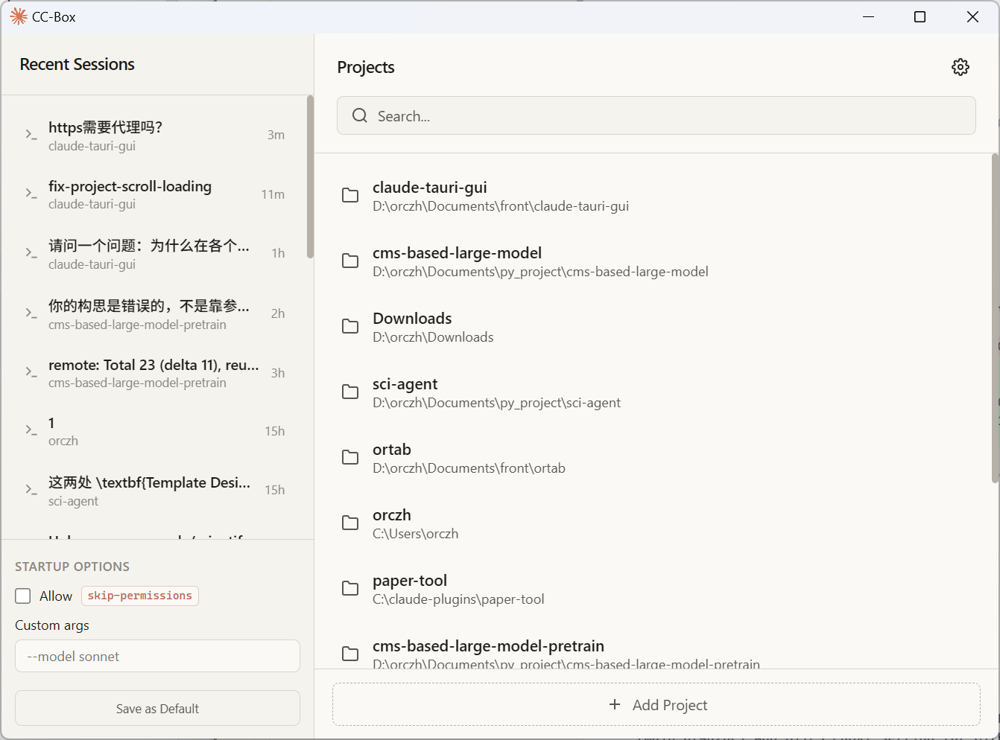
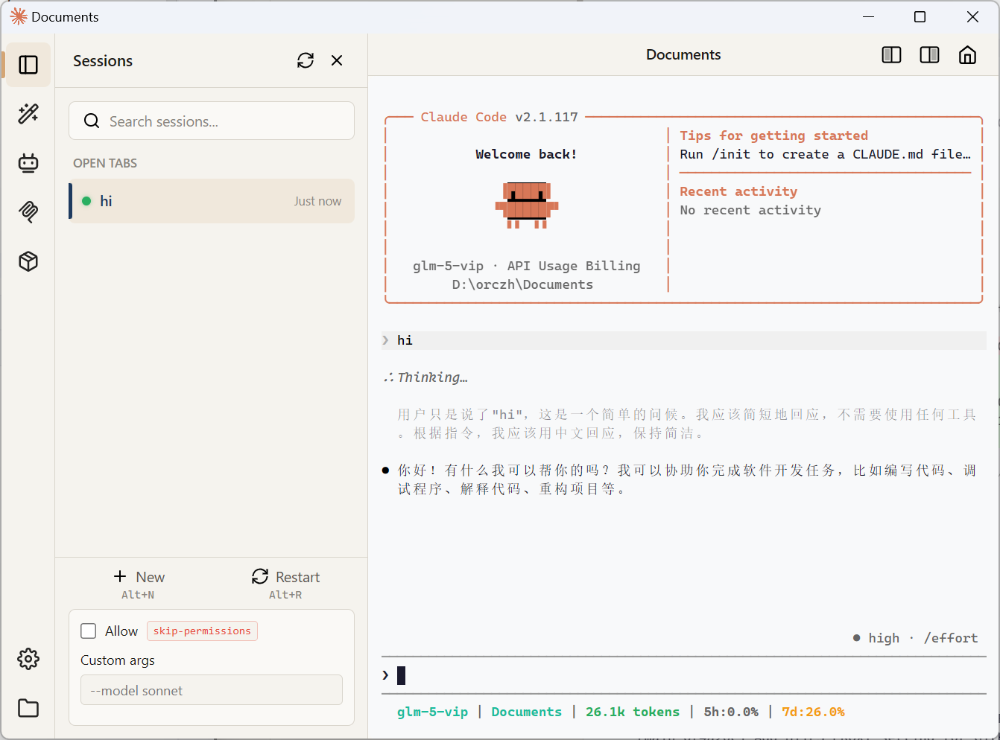

<p align="center">
  
</p>

<h1 align="center">CC Desk</h1>

<p align="center">
  <strong>Claude Code + Codex CLI 原生桌面工作台 — 多项目、多会话管理</strong><br>
  一个窗口。真实 CLI。项目与终端标签页相互隔离。
</p>

<p align="center">
  
  
  
  
</p>

---

[English](README.md) | 简体中文

---

## 为什么选择 CC Desk？

Claude Code 和 Codex CLI 最有价值的部分仍然是它们自己的原生终端交互。CC Desk 在真实 CLI 外层提供桌面工作台：显式项目登记、每 CLI 独立 profile、多终端标签页、原生恢复入口，以及按来源隔离的资源面板。

原生路径**不会**用 SDK 或 App Server 替代 CLI。认证、模型选择、权限提示、slash 命令、编辑器和其他原生行为仍由用户安装的 CLI 自己负责。

兼容性按证据判断。未知 CLI 版本可以继续尝试启动，但不会自动被标记为“已认证”；只有通过机器可校验 acceptance gate 的目标组合，才属于认证范围。

---

## 界面截图

<p align="center">
  
  
</p>

---

## 核心功能

### 多项目管理

在一个窗口中浏览所有项目。查看哪些项目有活跃会话，一键启动新会话，即时切换项目。不再需要频繁 `cd` 切换目录或管理多个终端窗口。

### 多会话并行

Claude Code 与 Codex CLI 可以并行运行。每个原生标签页冻结自己的 CLI / profile / 项目 / run 身份，输入、输出、重启状态和恢复不会串到相邻标签页。

### 快速启动与预设

使用每 CLI 独立 profile 和显式项目登记。可以 New、调用 CLI 自己的 resume picker、按已知 session ID 恢复，或传入精确 raw argv 数组；Desk 不把 raw argv 当 shell 字符串重新解析。

### Provider 管理

可直接管理 Provider 预设，也可从 cc-switch 导入已有配置。激活 Provider 是显式操作，只会把所选 Provider 负责的 env/model 字段合并到 `~/.claude/settings.json`，不会覆盖无关的 Claude 设置。

### 侧边栏面板

非遮罩式侧边栏，不会抢占焦点。原生资源投影绑定到当前 CLI profile 与已登记项目 root；某项能力不可用时明确显示 unavailable，不会偷用另一套 CLI 的配置或历史。

已有 Claude 面板在支持范围内继续保留；Codex 的配置根、历史和资源读取与 Claude 隔离。

### 原生终端体验

通过受控伪终端直接运行真实 Claude Code 或 Codex CLI 二进制文件。宿主负责保持 raw argv、有序输入、终端协议回复、有界输出背压、resize、剪贴板/IME 与进程所有权，不会静默切换到其他 executable 或旧 PTY 路径。

---

## 先决条件

安装并完成你准备使用的 CLI 认证：

- **[Claude Code CLI](https://docs.anthropic.com/en/docs/claude-code)**
- **[Codex CLI](https://developers.openai.com/codex/cli/reference)**
- **Windows / 源码构建**：同时满足对应 CLI 的 Windows 运行要求，以及下文 Rust/MSVC 构建要求。

---

## 快速开始

### 1. 下载安装

前往 [**Releases**](https://github.com/shawnwu2022/cc-desk/releases) 页面下载对应平台的安装包：

| 平台 | 文件 |
|------|------|
| **Windows** | `.exe` (NSIS 安装包) |
| **macOS** | `.dmg` (Apple 芯片) |
| **Linux** | `.AppImage` |

### 2. 启动使用

1. 打开应用并进入 **Native CLI**
2. 登记或选择项目目录
3. 选择或显式创建 Claude Code / Codex CLI profile
4. 选择 **New**、原生 **Resume**、已知 session ID 或 raw argv 启动
5. 按需打开多个标签页，每个 run 独立归属

---

## 从源码构建

<details>
<summary>点击展开</summary>

### 前置要求

- [Node.js](https://nodejs.org/) 20+
- [Rust](https://www.rust-lang.org/tools/install) stable 工具链（Windows 使用 MSVC）
- 你要测试的 Claude Code 和/或 Codex CLI 二进制
- **Windows 构建**：Microsoft C++ Build Tools 与 Windows SDK；CLI 运行要求以各自官方说明为准

### 安装

```bash
git clone https://github.com/shawnwu2022/cc-desk.git
cd cc-desk
npm install
```

### 开发

```bash
npm run tauri:dev     # 启动开发模式（热重载）
```

### 构建

```bash
npm run tauri:build   # 构建当前平台

# 或指定平台：
npm run build:win     # Windows (x86_64-pc-windows-msvc)
npm run build:mac     # macOS (通用)
npm run build:linux   # Linux (x86_64)
```

构建产物在 `src-tauri/target/release/bundle/`。

</details>

---

## 常见问题

<details>
<summary><strong>会修改原生 CLI 的配置或历史吗？</strong></summary>

双 CLI 原生工作台把 profile / 项目状态保存在 CC Desk 自己的 workspace 中，对原生 CLI 历史与配置投影保持只读。已有 Claude legacy GUI 兼容逻辑继续隔离存在。唯一明确例外是原有的 **Provider 激活**：只有用户显式操作时才会把选定 env/model 字段合并到 `~/.claude/settings.json`；这条 Claude 兼容逻辑不会应用到 Codex。
</details>

<details>
<summary><strong>能用所有 CLI 功能吗？</strong></summary>

CC Desk 不对 CLI 功能做白名单，原生终端能力尽量直接交给真实 CLI。但这不等于宣称所有 CLI / OS / 版本组合都已经认证。发布认证是目标组合级别的，必须由 acceptance evidence gate 支撑；缺失或 BLOCKED 的真实 CLI 证据不会被写成 PASS。
</details>

<details>
<summary><strong>性能如何？</strong></summary>

基于 Tauri 2 (Rust 后端)，安装后约 10 MB，内存占用极低。终端通过 xterm.js 渲染，性能与原生终端相当。
</details>

<details>
<summary><strong>Claude Code 或 Codex CLI 更新后怎么办？</strong></summary>

未知版本不会仅因为 GUI 尚未见过就被阻止启动，但也不会自动获得“已认证”状态。仓库提供 pinned/latest canary 与目标组合 acceptance evidence，用于发现变化并重新认证；已经运行中的用户会话不会因为 canary 变化被自动重启或改写。
</details>

---

## 项目来源

CC Desk 最初基于 [orczh-hj/cc-box](https://github.com/orczh-hj/cc-box) fork，随后因产品目标与实现路径逐渐不同，现作为独立项目维护，并非原项目的官方后继版本。

项目保留原始 MIT 许可证和版权声明，详见 [LICENSE](LICENSE)；更完整的来源说明见 [NOTICE.md](NOTICE.md)。

CC Desk 使用新的应用标识，因此会与 CC-Box 分开安装；既有设置仍从 `~/.cc-box/` 复用。确认新版本运行正常后，再单独卸载旧应用。

---

## 技术栈

Tauri 2 (Rust) + Vue 3 + TypeScript + xterm.js + portable-pty

---

## 许可证

[MIT](LICENSE)